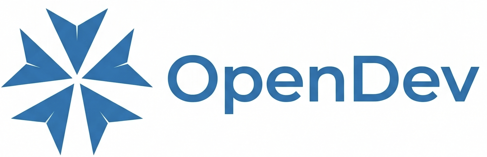

<p align="center">
  
</p>

<p align="center">
  <strong>An Open, Terminal-Native Coding Agent for Autonomous Software Engineering</strong>
</p>

<p align="center">
  Compound AI System • Multi-Model Routing • Context Engineering • MCP Integration • Defense-in-Depth Safety
</p>

<p align="center">
  <a href="https://pypi.org/project/opendev/"></a>
  <a href="./LICENSE"></a>
  <a href="https://python.org/"></a>
  <a href="https://github.com/opendev-to/opendev/issues"></a>
  <a href="https://github.com/opendev-to/opendev/stargazers"></a>
</p>

<p align="center">
  <a href="#overview"><strong>Overview</strong></a> •
  <a href="#why-opendev"><strong>Why OpenDev?</strong></a> •
  <a href="#installation"><strong>Installation</strong></a> •
  <a href="#quick-start"><strong>Quick Start</strong></a> •
  <a href="#key-components"><strong>Key Components</strong></a>
</p>

<p align="center">
  
</p>

## Overview

**OpenDev** is an open-source, terminal-native coding agent built as a **compound AI system** — not a single monolithic LLM, but a structured ensemble of agents and workflows, each independently bound to a user-configured model. Work is organized into concurrent sessions composed of specialized sub-agents; each agent executes typed workflows (Execution, Thinking, Compaction) that independently bind to an LLM, enabling fine-grained cost, latency, and capability trade-offs per workflow.

<p align="center">
  
</p>
<p align="center"><em>Figure 1: OpenDev's four-level hierarchy (Session → Agent → Workflow → LLM) enables per-workflow model selection across any supported provider.</em></p>

### Why OpenDev?

The terminal is the operational heart of software development — source control, build systems, SSH sessions, and deployment all live here. Yet realizing effective autonomous assistance in this environment is non-trivial: agents must manage finite context windows over long sessions, prevent destructive operations when executing arbitrary commands, and extend capabilities without overwhelming the prompt budget. OpenDev addresses these challenges through:

- **Per-workflow LLM routing** — Different cognitive tasks (planning, execution, compaction) bind to different models, optimizing cost and capability independently.
- **Extended ReAct pipeline** — Explicit thinking and self-critique phases separate deliberation from action, with adaptive context compaction integrated directly into the reasoning loop.
- **Context engineering as a first-class concern** — Adaptive compaction progressively reduces older observations, event-driven system reminders counteract instruction fade-out, and an automated memory system accumulates project knowledge across sessions.
- **Defense-in-depth safety** — Five independent layers (prompt guardrails, schema-level tool gating, runtime approval, tool-level validation, lifecycle hooks) enforce constraints at progressively lower levels of abstraction.
- **Token-efficient extensibility** — A registry-based tool architecture with lazy MCP discovery keeps the prompt budget lean while supporting arbitrary external tools.

## Installation

We recommend using [uv](https://github.com/astral-sh/uv) for fast and reliable installation.

### User Installation
```bash
uv pip install opendev
```

### Development Setup

#### 1. Clone and install dependencies

```bash
git clone https://github.com/opendev-to/opendev.git
cd opendev

# Create venv and install the package with dev dependencies
uv venv
uv pip install -e ".[dev]"
```

#### 2. Activate the virtual environment

```bash
source .venv/bin/activate
```

#### 3. Run the app

```bash
# After activating venv
opendev

# Or without activating
uv run opendev
```

#### 4. Run pytest

```bash
# Run all tests
uv run pytest

# Run specific test file
uv run pytest tests/test_terminal_box_renderer.py

# Run with verbose output
uv run pytest -v

# Run with coverage
uv run pytest --cov=opendev
```

#### Quick one-liner setup

```bash
uv venv && uv pip install -e ".[dev]" && uv run pytest
```

## Development

### Code Quality

```bash
# Formatting
black opendev/ tests/ --line-length 100

# Linting
ruff check opendev/ tests/ --fix

# Type checking
mypy opendev/
```

### Web UI

The frontend is a React/Vite app in `web-ui/`, built to `opendev/web/static/`:

```bash
cd web-ui && npm run build
```

### MCP Server Management

```bash
opendev mcp list
opendev mcp add myserver uvx mcp-server-sqlite
opendev mcp enable/disable myserver
```

## Quick Start

1.  **Configure**: Run the setup wizard to configure your LLM providers.
    ```bash
    opendev config setup
    ```

2.  **Run**: Start the interactive coding assistant.
    ```bash
    opendev
    ```
    *Or start the Web UI:*
    ```bash
    opendev run ui
    ```

## Key Components

- **Dual Frontends** — A Textual-based TUI for terminal use and a FastAPI + React Web UI, both sharing a common agent layer.
- **Multi-Provider Support** — Native support for OpenAI, Anthropic, Fireworks, Google, and any OpenAI-compatible endpoint, with model capabilities cached from a shared registry.
- **MCP Integration** — Dynamic tool discovery via the Model Context Protocol for connecting to external tools and data sources.
- **Session Persistence** — Full conversation histories saved as JSON with project-scoped sessions and cross-session memory.
- **Modular Prompt Composition** — System prompts assembled from independent, priority-ordered markdown sections that load only when contextually relevant.

## License

[MIT](LICENSE)
